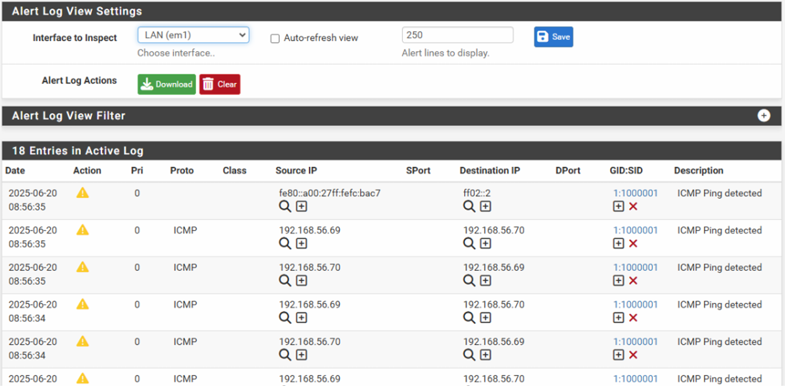
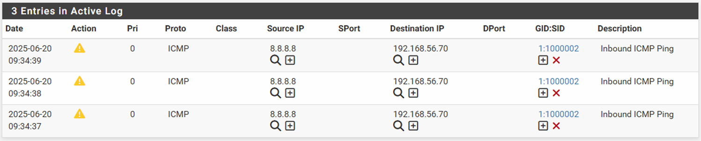
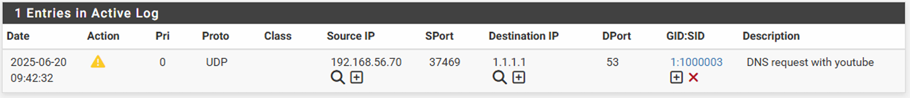
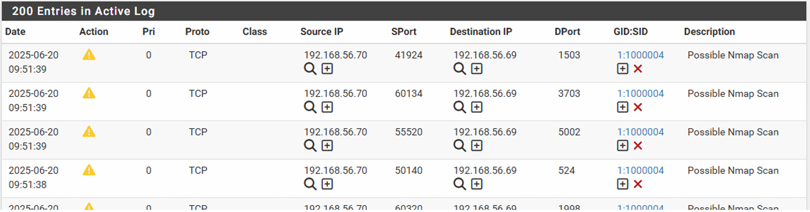
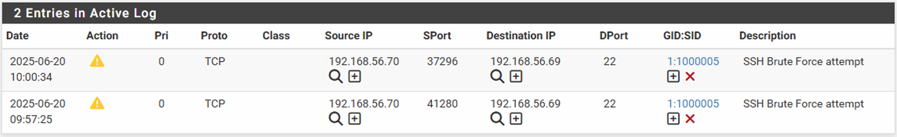
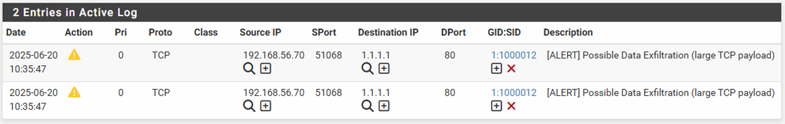
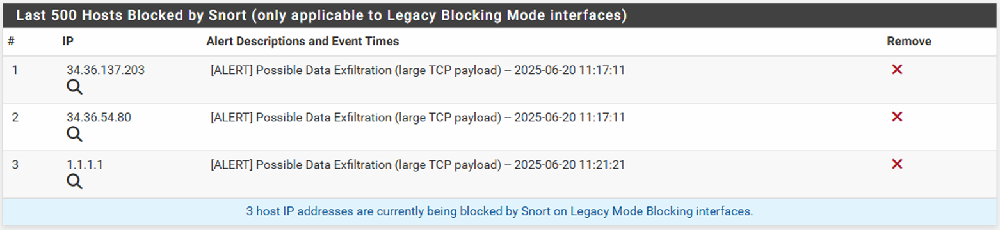

# Snort IDS/IPS on pfSense — HEPIA Summer Lab

This folder contains my Snort lab on pfSense, used first as an **IDS** (alert‑only) and then as an **IPS** (Block Offenders + Kill States).  
Full write‑up: [`../docs/Report_SNORT.pdf`](../docs/Report_SNORT.pdf)

## Rules (SIDs)
- **1000001** — ICMP Ping detected (all ICMP)  
  
- **1000002** — Inbound ICMP Ping (external → internal)  
  
- **1000003** — DNS request with "youtube" (policy alert)  
  
- **1000004** — Possible Nmap Scan (SYN threshold)  
  
- **1000005** — SSH Brute Force attempt (>3 in 60s)  
  
- **10000012** — Possible Data Exfiltration (large TCP payload)  
  

When IPS is enabled (Block Offenders + Kill States), offenders appear here:  


## How to run

### IDS (alert‑only)
1. pfSense → **Services → Snort → LAN** → Enable interface  
2. **LAN Rules → custom.rules** (see `rules/custom.rules`)  
3. Start Snort on LAN (blue ▶)

### IPS (active blocking)
1. pfSense → **Services → Snort → LAN → Block Settings**  
2. Enable **Block Offenders** and **Kill States**  
3. Re‑run the tests below; repeated attempts are blocked

> Inline mode was not used here (virtual NIC constraints). The IPS path relies on Block Offenders + Kill States.

## Quick tests (from Ubuntu client)

```bash
./scripts/ping_gateway.sh
./scripts/dns_youtube.sh
./scripts/nmap_scan.sh
./scripts/ssh_bruteforce_loop.sh
./scripts/hydra_ssh.sh
./scripts/exfil_passwd.sh
```

### Expected outcomes
- ICMP: alerts for all pings (1000001), then only external (1000002) after refinement
- DNS: alert when resolving youtube.com (1000003)
- Nmap: burst of “Possible Nmap Scan” alerts (1000004)
- SSH: alert after >3 attempts/60s (1000005)
- Exfiltration: alert on large outbound payload (10000012); with IPS, the source is blocked

### Notes
- Interface‑scoped rules (WAN vs LAN) reduce false positives and focus detection per zone.
- HTTPS content is encrypted; detection relies on DNS or TLS SNI, not payload inspection.
